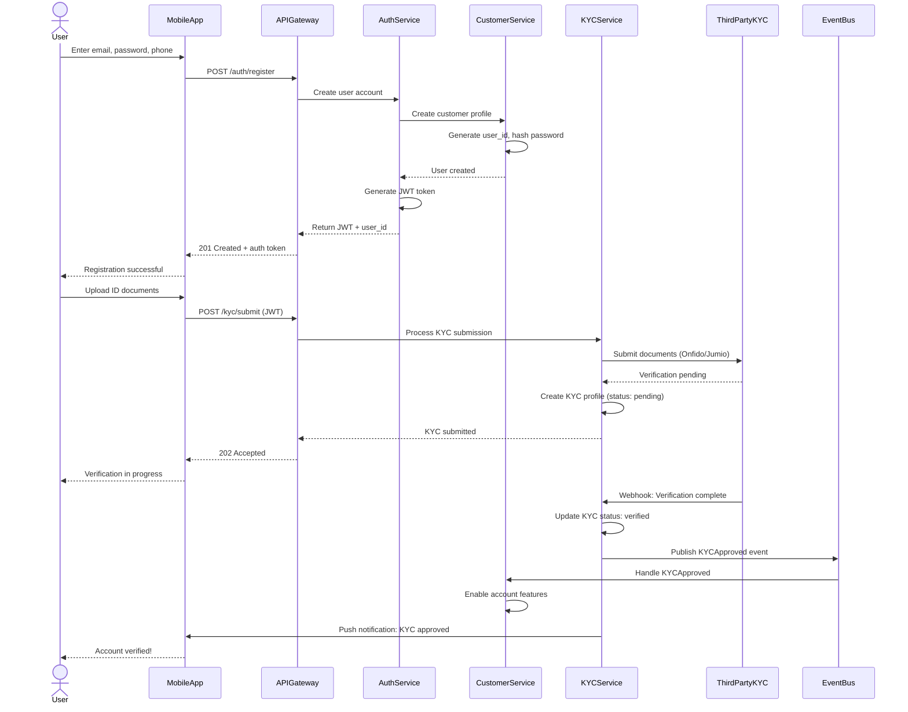
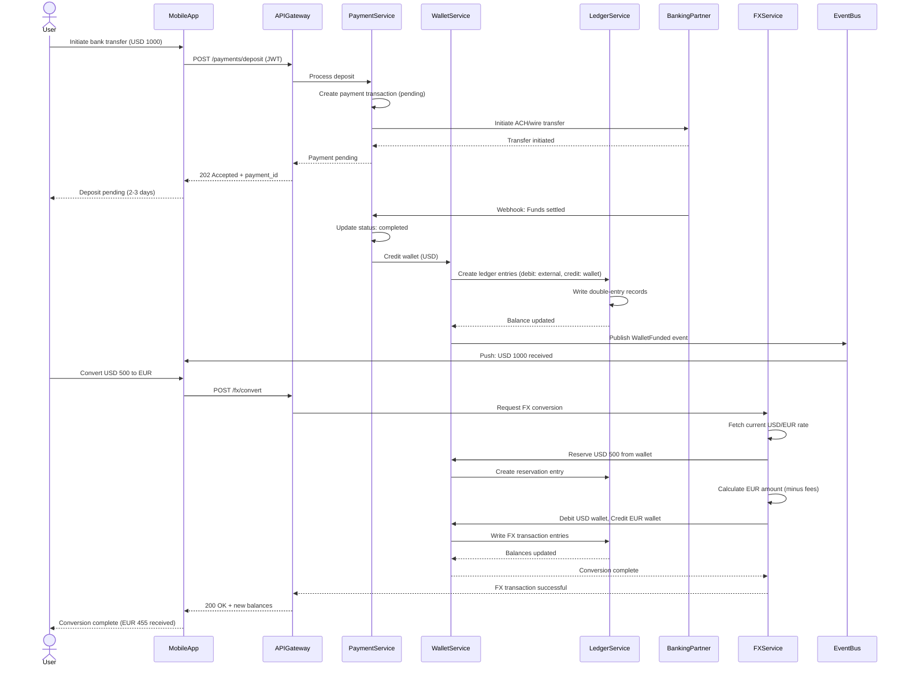
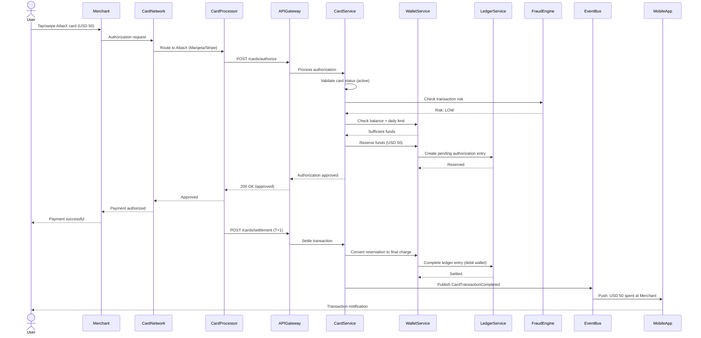
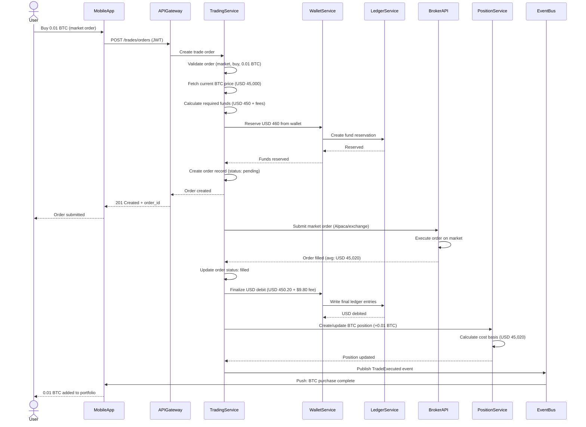
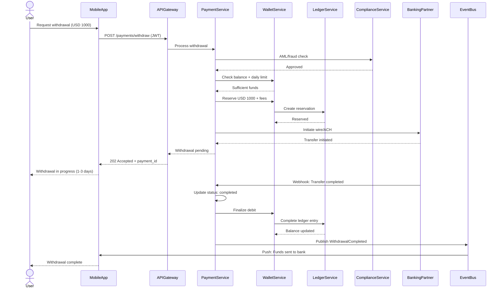
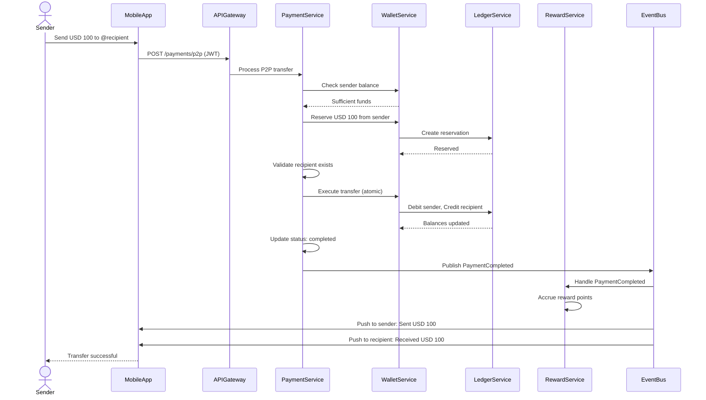
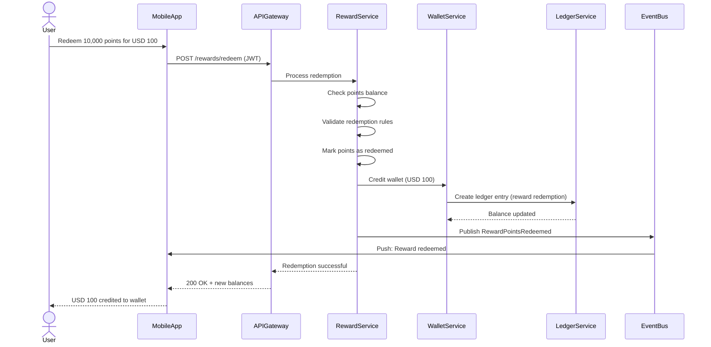
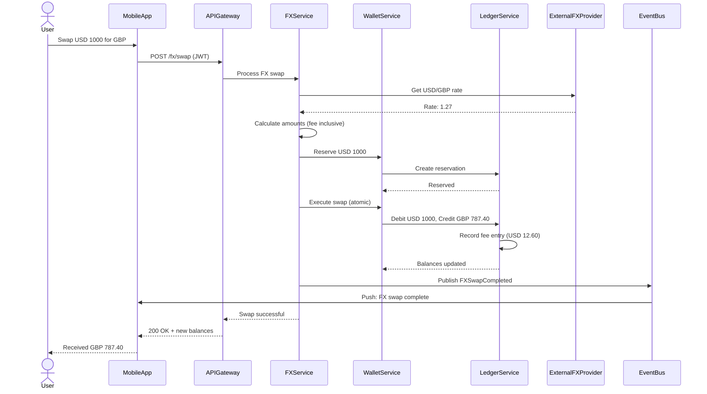

# AtlasX Sequence Diagrams

## Overview

This document contains Mermaid sequence diagrams for key user flows in AtlasX. These diagrams can be rendered in any Mermaid-compatible tool or directly in GitHub/GitLab markdown files.

**Version:** 1.0
**Date:** 2025-11-14

---

## 1. User Sign-Up + Basic KYC Submission

**Description:**
- User registers with email/password
- AuthService generates JWT token for authentication
- User uploads KYC documents (ID, proof of address)
- KYCService integrates with third-party provider (Onfido, Jumio)
- Asynchronous verification via webhook
- Event-driven account activation

---

## 2. Funding a Wallet and FX Conversion

**Description:**
- User initiates bank deposit via ACH/wire
- Asynchronous settlement (2-3 days typical)
- Webhook notification when funds arrive
- Double-entry ledger records for audit trail
- FX conversion with real-time rates
- Multi-currency wallet support

---

## 3. Card Payment (Happy Path)

**Description:**
- Real-time card authorization flow
- Fraud check integration
- Fund reservation during authorization
- Settlement typically T+1 (next day)
- Double-entry ledger for both authorization and settlement
- Push notification to user

---

## 4. Placing a Simple Market Trade (Buy BTC)

**Description:**
- User places market order for crypto/stock
- Fund reservation before broker submission
- Integration with third-party broker (Alpaca, Interactive Brokers)
- Position management with cost basis tracking
- Ledger entries for audit trail
- Real-time notification on trade execution

---

## 5. Withdrawal Flow (Wallet to Bank)

**Description:**
- Compliance check before withdrawal
- Fund reservation during processing
- Integration with banking partner
- Asynchronous settlement
- Audit trail via ledger

---

## 6. P2P Transfer (User to User)

**Description:**
- Instant P2P transfer within platform
- Atomic ledger update (both debit and credit)
- Reward points accrued for transaction
- Real-time notifications to both parties
- No external payment rail involved

---

## 7. Reward Points Redemption

**Description:**
- User redeems accumulated points
- Validation of points balance and redemption rules
- Wallet credit via ledger entry
- Event-driven analytics tracking

---

## 8. Multi-Currency FX Swap

**Description:**
- Real-time FX rate from provider
- Fee calculation and display
- Atomic multi-currency wallet update
- Audit trail with separate fee entry

---

## Usage

**Rendering these diagrams:**

1. **GitHub/GitLab:** Diagrams render automatically in markdown files
2. **Mermaid Live Editor:** https://mermaid.live/
3. **VS Code:** Install "Markdown Preview Mermaid Support" extension
4. **Documentation sites:** Docusaurus, MkDocs support Mermaid natively

**Customization:**
- Add/remove participants as services evolve
- Adjust granularity based on audience (exec summary vs. technical deep-dive)
- Include error paths for comprehensive documentation

---

**Document End**
