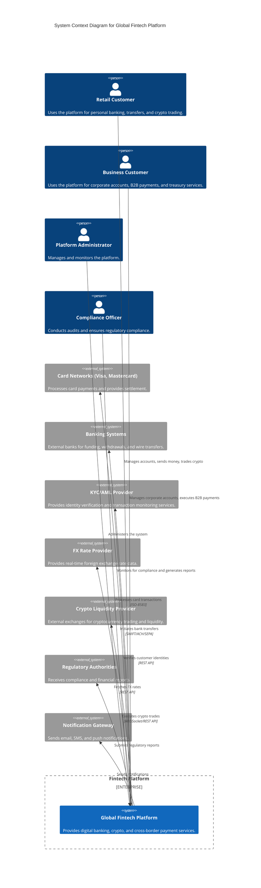

```mermaid
C4Context
  title System Context Diagram for Global Fintech Platform

  Enterprise_Boundary(b, "Fintech Platform") {
    System(fintech_platform, "Global Fintech Platform", "Provides digital banking, crypto, and cross-border payment services.")
  }

  Person(retail_customer, "Retail Customer", "Uses the platform for personal banking, transfers, and crypto trading.")
  Person(business_customer, "Business Customer", "Uses the platform for corporate accounts, B2B payments, and treasury services.")
  Person(admin_user, "Platform Administrator", "Manages and monitors the platform.")
  Person(compliance_officer, "Compliance Officer", "Conducts audits and ensures regulatory compliance.")

  System_Ext(card_networks, "Card Networks (Visa, Mastercard)", "Processes card payments and provides settlement.")
  System_Ext(banking_systems, "Banking Systems", "External banks for funding, withdrawals, and wire transfers.")
  System_Ext(kyc_provider, "KYC/AML Provider", "Provides identity verification and transaction monitoring services.")
  System_Ext(fx_provider, "FX Rate Provider", "Provides real-time foreign exchange rate data.")
  System_Ext(crypto_liquidity, "Crypto Liquidity Provider", "External exchanges for cryptocurrency trading and liquidity.")
  System_Ext(regulators, "Regulatory Authorities", "Receives compliance and financial reports.")
  System_Ext(notification_gateway, "Notification Gateway", "Sends email, SMS, and push notifications.")

  Rel(retail_customer, fintech_platform, "Manages accounts, sends money, trades crypto")
  Rel(business_customer, fintech_platform, "Manages corporate accounts, executes B2B payments")
  Rel(admin_user, fintech_platform, "Administers the system")
  Rel(compliance_officer, fintech_platform, "Monitors for compliance and generates reports")

  Rel(fintech_platform, card_networks, "Processes card transactions", "ISO-8583")
  Rel(fintech_platform, banking_systems, "Initiates bank transfers", "SWIFT/ACH/SEPA")
  Rel(fintech_platform, kyc_provider, "Verifies customer identities", "REST API")
  Rel(fintech_platform, fx_provider, "Fetches FX rates", "REST API")
  Rel(fintech_platform, crypto_liquidity, "Executes crypto trades", "WebSocket/REST API")
  Rel(fintech_platform, regulators, "Submits regulatory reports")
  Rel(fintech_platform, notification_gateway, "Sends notifications")
```
